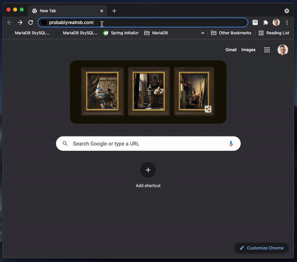

# Terminal Style Website

This repository contains an interactive terminal console style website. 

    <kbd>
        
    </kbd>

## Ingredients

The following pieces bring this site together:

* [index.html](index.html): The default/launch web page.

* [cli.js](scripts/cli.js): JavaScript file that contains the mock Command Line Interface (CLI) management functionality.

* [shell.js](scripts/shell.js): JavaScript file that contains the mock Terminal functionality.

* [main.css](styles/main.css): Main CSS for the Terminal UI.

* [fa-all.css](styles/fa-all.css): [Font Awesome](https://fontawesome.com/) CSS styles.

## Live Demo

https://probablyrealrob.com
